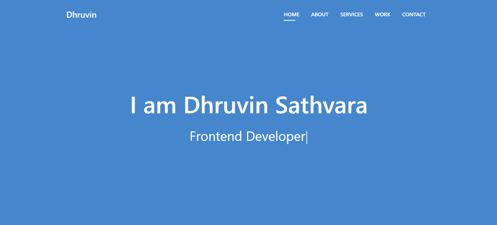

# Personal Protfolio

# Requirements

- [x]  Fully styled and responsive website
- [x]  Consistent color scheme and typography
- [x] Use flexbox, media queries,grid and Frameworks to create a responsive layout
- [x] Used a JS for Animations

# Bonus:

- [x]  Utilize Google Fonts
- [x]  Link to GitHub pages
- [x]  Best Section is Projects